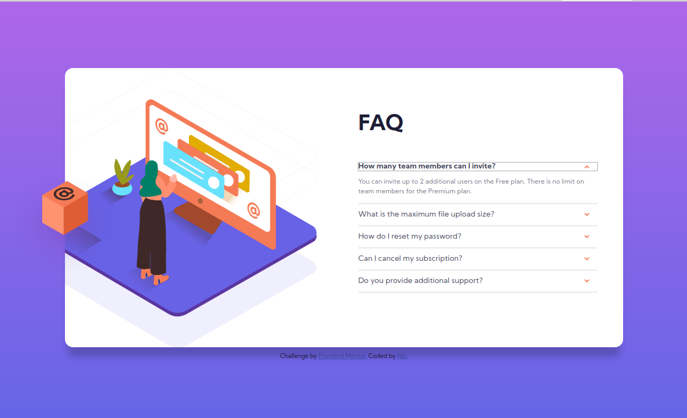

# FAQ Accordion Card
> [Frontend Mentor](https://www.frontendmentor.io/)'s FAQ Accordion Card

## Table of contents
* [General info](#general-info)
* [Screenshots](#screenshots)
* [Technologies](#technologies)
* [Learnings](#learnings)
* [Setup](#setup)
* [Features](#features)
* [Status](#status)
* [Inspiration](#inspiration)
* [Contact](#contact)

## General info
I didn't know how to do an accordion, so I tried this. The challenge included an additional challenge of not using JavaScript. Since I could work out how to do it with JavaScript I did it without.

## Screenshots

## Technologies
* HTML: details and summary tags
* SCSS
* Gulp 4

## Learnings
* HTML details and summary tags

## Setup
To view this project visit the [demo](https://frontendmentor-faq-accordion.netlify.app/) or download the files and open index.html

## Features
* Accordion

## Status
Project is: _finished_

## Inspiration
Design provided by [Frontend Mentor](https://www.frontendmentor.io/)

## Contact
Created by [nicm42](https://www.twitter.com/nicm4242) - feel free to contact me!
